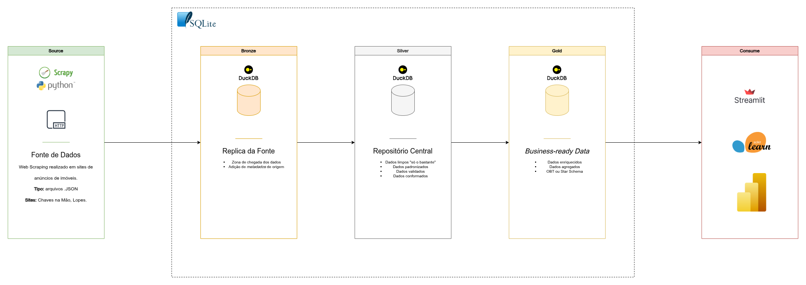

# 🏢 Report de Mercado - Universidade dos Dados

### 📜Sumário
1. 📌 [Sobre o Projeto](#-sobre-o-projeto)
2. ⚙️ [Tecnologias Utilizadas](#️-tecnologias-utilizadas)
3. 🚀 [Como Executar](#-como-executar)
4. 📊 [Estrutura do Projeto](#-estrutura-do-projeto)
5. 🗒️ [Licença](#️-licença)
6. 📞 [Contato](#-contato)

## 📌 Sobre o Projeto

## ⚙️ Tecnologias Utilizadas

## 🚀 Como Executar

## 📊 Estrutura do Projeto

## 🗒️ Licença

## 📞 Contato
- 📬 datalopes1@proton.me
- 🖱️ https://datalopes1.github.io/
- 📱 +55 88 99993-4237